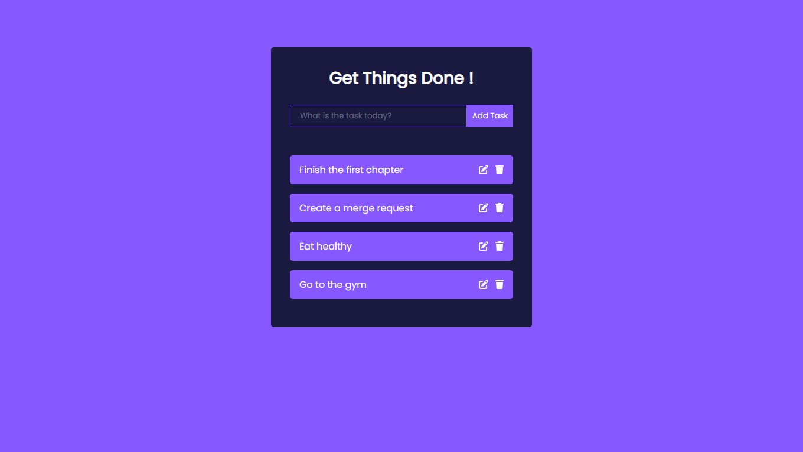

# Todo List App (React.js)

A simple and intuitive Todo List application built with React.js, allowing users to add, edit, and delete tasks.



## Features

- **Add Tasks**: Easily add new tasks to your list.
- **Edit Tasks**: Modify existing tasks to keep them up-to-date.
- **Delete Tasks**: Remove tasks that are no longer needed.

## Technologies Used

- **React.js**: JavaScript library for building user interfaces.
- **CSS**: Styling for a clean and responsive design.

## Getting Started

### Prerequisites

Ensure you have the following installed:

- [Node.js](https://nodejs.org/)
- [npm](https://www.npmjs.com/)

### Installation

1. **Clone the repository**

   ```bash
   git clone https://github.com/rimarayya/todo-list-app-react-js
   ```

2. **Move to the project directory**

   ```bash
   cd todo-list-app-react-js
   ```

3. **Install dependencies**

   ```bash
   npm install
   ```

4. **Run the development server**

   ```bash
   npm run start
   ```

5. **Build for production**

   ```bash
   npm run build
   ```

---

## 🤝 Contributing

Contributions are welcome!
